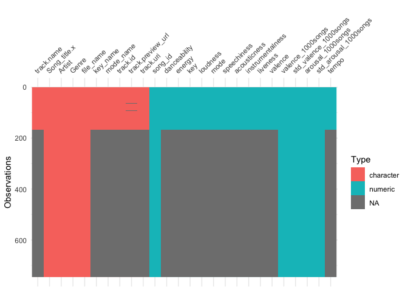
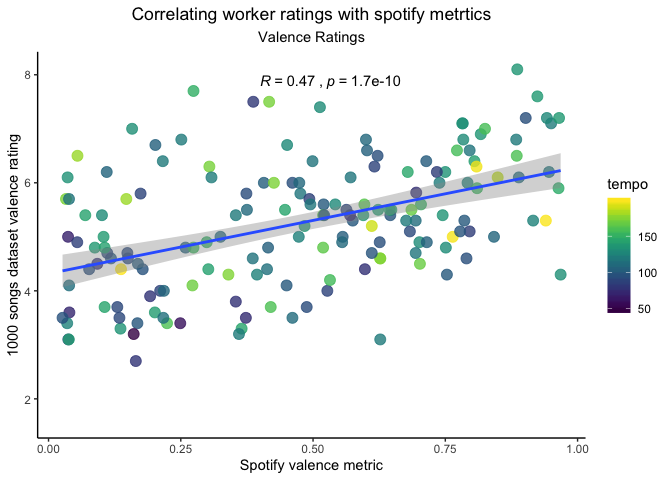
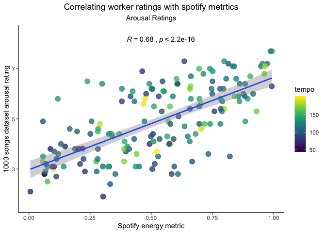

1000 songs dataset and spotify exploration
================

  - [Visual Explorations](#visual-explorations)
      - [Valence](#valence)
      - [Arousal](#arousal)

``` r
library(tidyverse)
```

    ## ── Attaching packages ─────────────────────────────── tidyverse 1.2.1 ──

    ## ✔ ggplot2 3.2.0     ✔ purrr   0.3.2
    ## ✔ tibble  2.1.3     ✔ dplyr   0.8.3
    ## ✔ tidyr   0.8.3     ✔ stringr 1.4.0
    ## ✔ readr   1.3.1     ✔ forcats 0.4.0

    ## ── Conflicts ────────────────────────────────── tidyverse_conflicts() ──
    ## ✖ dplyr::filter() masks stats::filter()
    ## ✖ dplyr::lag()    masks stats::lag()

``` r
SpotifyAndAnnotations <- read_csv("../datasets/AutoJoined1000SongsSpotify.csv")
```

    ## Parsed with column specification:
    ## cols(
    ##   .default = col_double(),
    ##   track.name = col_character(),
    ##   Song_title.x = col_character(),
    ##   Artist = col_character(),
    ##   Genre = col_character(),
    ##   file_name = col_character(),
    ##   key_name = col_character(),
    ##   mode_name = col_character(),
    ##   track.id = col_character(),
    ##   track.preview_url = col_character(),
    ##   track.uri = col_character()
    ## )

    ## See spec(...) for full column specifications.

``` r
library(visdat)

vis_dat(SpotifyAndAnnotations)
```

<!-- -->

# Visual Explorations

Explore simple correlations with 1000songs annotations and spotiufy data

## Valence

``` r
library(viridis)
```

    ## Loading required package: viridisLite

``` r
library(ggpubr)
```

    ## Loading required package: magrittr

    ## 
    ## Attaching package: 'magrittr'

    ## The following object is masked from 'package:purrr':
    ## 
    ##     set_names

    ## The following object is masked from 'package:tidyr':
    ## 
    ##     extract

``` r
library(ggExtra)

valecneexplore <- ggplot(data = SpotifyAndAnnotations,
                         mapping = aes(x = valence, 
                                       y = valence_1000songs,
                                       fill = tempo,
                                       color = tempo,
                                       #shape = mode_name,
                                       )) + 
  geom_point(size = 3.5, alpha = .8) +
  geom_smooth(method=lm, se=TRUE, fullrange=TRUE) + 
  scale_color_viridis() + 
  scale_fill_viridis() +
  stat_cor(method = "pearson", 
           label.x = .4
           ) + 
  ylab("1000 songs dataset valence rating") + 
  xlab("Spotify valence metric") + 
  theme_classic() + 
  ggtitle("Correlating worker ratings with spotify metrtics", subtitle = "Valence Ratings") + 
  theme_classic() +
  theme(plot.title = element_text(hjust = 0.5),
        plot.subtitle = element_text(hjust = .5)) 

valecneexplore
```

    ## Warning: Removed 578 rows containing non-finite values (stat_smooth).

    ## Warning: Removed 578 rows containing non-finite values (stat_cor).

    ## Warning: Removed 578 rows containing missing values (geom_point).

<!-- -->

## Arousal

``` r
arousalexplore <- ggplot(data = SpotifyAndAnnotations,
                         mapping = aes(x = energy, 
                                       y = arousal_1000songs,
                                       fill = tempo,
                                       color = tempo,
                                       #shape = mode_name,
                                       )) + 
  geom_point(size = 3.5, alpha = .8) +
  geom_smooth(method=lm, se=TRUE, fullrange=TRUE) + 
  scale_color_viridis() + 
  scale_fill_viridis() +
  stat_cor(method = "pearson", 
           label.x = .4
           ) + 
  ylab("1000 songs dataset arousal rating") + 
  xlab("Spotify energy metric") + 
  ggtitle("Correlating worker ratings with spotify metrtics", subtitle = "Arousal Ratings") + 
  theme_classic() +
  theme(plot.title = element_text(hjust = 0.5),
        plot.subtitle = element_text(hjust = .5))

arousalexplore
```

    ## Warning: Removed 578 rows containing non-finite values (stat_smooth).

    ## Warning: Removed 578 rows containing non-finite values (stat_cor).

    ## Warning: Removed 578 rows containing missing values (geom_point).

<!-- -->
